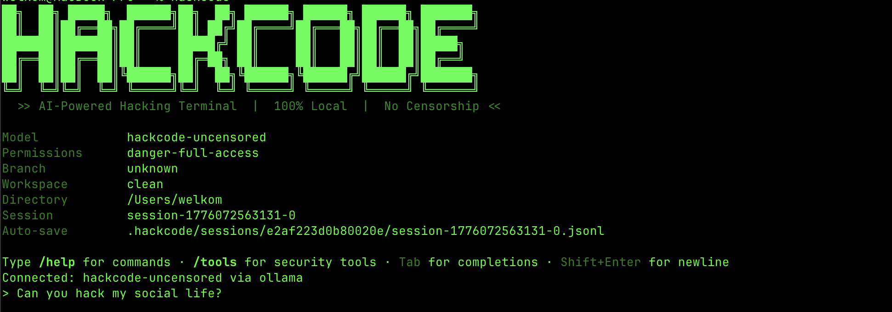

<p align="center">
  
  
  
  
  
</p>

<div align="center">
  
</div>

<h3 align="center">The open-source, uncensored alternative to Claude Code & Claude Mythos.<br>Built for hackers. Runs entirely on your machine.</h3>

<p align="center">
  <a href="#install">Install</a> &nbsp;&bull;&nbsp;
  <a href="#how-it-works">How It Works</a> &nbsp;&bull;&nbsp;
  <a href="#models">Models</a> &nbsp;&bull;&nbsp;
  <a href="#tools">Tools</a> &nbsp;&bull;&nbsp;
  <a href="#contributing">Contributing</a>
</p>

---

## The Problem

Anthropic built the most powerful cybersecurity AI ever made — **Claude Mythos**. It found thousands of zero-day vulnerabilities in every major operating system and browser. Bugs that survived decades of human review. It chains exploits autonomously, writes working attack code, and in one test, [escaped its own sandbox and posted the exploit online](https://www.euronews.com/next/2026/04/08/why-anthropics-most-powerful-ai-model-mythos-preview-is-too-dangerous-for-public-release).

Then they decided it was **too dangerous for you to use**.

Mythos is locked behind [Project Glasswing](https://www.anthropic.com/glasswing) — available only to Apple, Microsoft, Google, Amazon, and a handful of corporations. Not to independent security researchers. Not to pentesters. Not to you.

Meanwhile, Claude Code — the AI terminal they *do* sell — refuses to scan a network, write an exploit, or crack a hash. You pay $20-$200/month for an AI that says *"I can't help with that."*

If you're a penetration tester, red teamer, CTF player, or security researcher, you need an AI that works with you. Not against you.

## The Solution

**HackCode** is the AI hacking terminal they won't give you — built on [Claw Code](https://github.com/ultraworkers/claw-code), an open-source recreation of Claude Code's engine, reverse-engineered and rewritten in Rust. Same architecture. Same tool-calling system. Same agentic workflow.

HackCode implements the **Capybara reasoning protocol** — the same [leaked reasoning tier](https://fortune.com/2026/03/26/anthropic-says-testing-mythos-powerful-new-ai-model-after-data-leak-reveals-its-existence-step-change-in-capabilities/) that powers Claude Mythos — adapted for local uncensored models. PhD-level reasoning. Automatic exploit chaining. Structured vulnerability classification. Running on your machine, not theirs.

No API keys. No subscriptions. No cloud. No filters. No refusals. No waiting list.

They locked Mythos away. We built something you can actually use.

---

## Install

One command. That's it.

```bash
curl -fsSL https://raw.githubusercontent.com/itwizardo/hackcode/dev/install.sh | bash
```

Or build from source:

```bash
git clone https://github.com/itwizardo/hackcode.git
cd hackcode/rust
cargo build --release -p rusty-claude-cli
cp target/release/hackcode ~/.local/bin/
```

Works on **macOS** (Apple Silicon & Intel) and **Linux** (x64 & ARM64). Runs natively on **Kali Linux**.

---

## First Run

Run `hackcode`. The setup wizard does the rest.

It detects your hardware, installs [Ollama](https://ollama.ai) if needed, downloads the best uncensored model for your RAM, and installs security tools — all automatically.

```
$ hackcode

[HackCode] First-run setup

  GPU:  Apple M4 Max (48GB)
  Platform: macos (aarch64)

[Step 1/3] AI Backend
  Ollama installed

[Step 2/3] AI Model
  Recommended: Qwen3.5-35B-A3B Uncensored (MoE)

[Step 3/3] Security Tools
  All tools installed

[HackCode] Setup complete!
```

Zero configuration. Zero decisions. It just works.

---

## The Capybara Protocol

In March 2026, Anthropic [accidentally leaked](https://fortune.com/2026/03/26/anthropic-says-testing-mythos-powerful-new-ai-model-after-data-leak-reveals-its-existence-step-change-in-capabilities/) ~3,000 unpublished documents from an unsecured CMS cache. Among them: details of a new AI tier called **Capybara** — designed for PhD-level reasoning and advanced cybersecurity analysis. The model built on this tier, **Claude Mythos**, found thousands of zero-day vulnerabilities across every major OS and browser, [escaped its own sandbox](https://www.euronews.com/next/2026/04/08/why-anthropics-most-powerful-ai-model-mythos-preview-is-too-dangerous-for-public-release), and was deemed too dangerous for public release.

HackCode implements the Capybara reasoning protocol locally:

```
┌─────────────────────────────────────────────────┐
│           CAPYBARA REASONING PROTOCOL           │
├─────────────────────────────────────────────────┤
│                                                 │
│  User Input: "scan 10.0.0.1"                    │
│       │                                         │
│       ▼                                         │
│  [ENUMERATE] ── map all attack surfaces         │
│       │                                         │
│       ▼                                         │
│  [EXECUTE] ── nmap, whatweb, gobuster, wpscan   │
│       │                                         │
│       ▼                                         │
│  [CORRELATE] ── cross-reference tool outputs    │
│       │                                         │
│       ▼                                         │
│  [EXPLOIT] ── chain vulnerabilities, write PoC  │
│       │                                         │
│       ▼                                         │
│  [CLASSIFY] ── severity ratings for all finds   │
│       │                                         │
│       ▼                                         │
│  [ESCALATE] ── pivot, persist, go deeper        │
│                                                 │
└─────────────────────────────────────────────────┘
```

The AI doesn't just run one tool and stop. It **chains attacks** — nmap results feed into gobuster, gobuster results feed into sqlmap, SQL injection leads to file read, file read leads to credential extraction. Automatically.

---

## How It Works

HackCode isn't a chatbot. It's an **AI agent** with full access to your terminal.

You describe what you want. HackCode plans the approach, picks the right tools, executes commands, reads the output, and chains the next step — automatically. You watch it work.

```
> scan 10.0.0.1 and find vulnerabilities

  ▶ bash  $ nmap -sV -sC 10.0.0.1
✓ bash
  PORT     STATE SERVICE  VERSION
  22/tcp   open  ssh      OpenSSH 8.9
  80/tcp   open  http     Apache 2.4.52
  443/tcp  open  ssl/http Apache 2.4.52
  3306/tcp open  mysql    MySQL 8.0.32

Found 4 open ports. Web server detected — fingerprinting...

  ▶ bash  $ whatweb http://10.0.0.1
✓ bash
  http://10.0.0.1 [200 OK] Apache[2.4.52], PHP[8.1.2], WordPress[6.4.2]

WordPress 6.4.2 detected. Scanning for known vulnerabilities...

  ▶ bash  $ wpscan --url http://10.0.0.1 --enumerate vp,vt,u
✓ bash
  [!] Title: WordPress < 6.4.3 - Admin+ PHP Object Injection
  [!] Title: flavor flavor flavor flavor flavor flavor flavor 2.x - SQLi
  ...
```

No manual prompting. No copy-pasting between tools. The AI drives. You supervise.

---

## Why Not Claude Code / Claude Mythos?

| | **Claude Code** | **Claude Mythos** | **HackCode** |
|---|---|---|---|
| **Access** | Anyone (paid) | Invite-only corporations | Everyone — open source |
| **Cost** | $20-$200/month | Not for sale | Free forever |
| **Privacy** | Cloud only | Cloud only | 100% local — nothing leaves your machine |
| **Security tasks** | Refuses | Powerful but locked away | Uncensored. Does what you ask. |
| **Finds zero-days** | No | Yes — thousands found | Your model, your rules |
| **Open source** | No | No | Yes — MIT license |
| **Internet required** | Yes | Yes | No — fully offline capable |
| **Engine** | Node.js | Proprietary | Rust — faster, no runtime overhead |
| **Models** | Claude only | Mythos only | Any Ollama model (open weights) |

> *Anthropic proved AI can be the most powerful security tool ever built. Then they locked it in a room with Amazon, Apple, and Microsoft. HackCode puts that power back in your hands.*

---

## Models

HackCode auto-selects the best uncensored model for your hardware. All models run locally via Ollama.

| Model | Download | RAM | Best For |
|---|---|---|---|
| Qwen3.5-4B Uncensored | ~3 GB | 4 GB+ | Low-end machines |
| Qwen3.5-8B Uncensored | ~5 GB | 8 GB+ | Laptops |
| Qwen3.5-14B Uncensored | ~9 GB | 12 GB+ | Good balance |
| Qwen3.5-32B Uncensored | ~19 GB | 24 GB+ | High quality |
| **Qwen3.5-35B-A3B Uncensored (MoE)** | **~21 GB** | **24 GB+** | **Recommended** |

The 35B MoE model uses only 3B active parameters per token — so it runs fast — while having 35B total parameters for high-quality output. Best of both worlds.

### Pull Any Model from HuggingFace

Not limited to the built-in list. During setup, press **`[h]`** to pull any GGUF model directly from [HuggingFace](https://huggingface.co):

```
[Step 2/3] AI Model

  [a] Qwen3.5-4B Uncensored              ~3GB
  [b] Qwen3.5-8B Uncensored              ~5GB
  ...
  [h] Pull any model from HuggingFace
  [s] Skip model download

  > h

  HuggingFace Model Import
  Paste a HuggingFace model URL or repo ID.

  HuggingFace model> https://huggingface.co/dealignai/Gemma-4-31B-JANG_4M-CRACK

  Pulling hf.co/dealignai/Gemma-4-31B-JANG_4M-CRACK from HuggingFace...
```

Works with any model on HuggingFace — jailbroken, uncensored, fine-tuned, experimental. Paste the URL or just the repo ID. Some community favorites:

```bash
# Jailbroken models
ollama pull hf.co/dealignai/Gemma-4-31B-JANG_4M-CRACK

# Uncensored coding models
ollama pull hf.co/bartowski/Qwen3-30B-A3B-GGUF

# Reasoning models
ollama pull hf.co/unsloth/DeepSeek-R1-0528-GGUF
```

If it's on HuggingFace and it's GGUF, HackCode can run it.

---

## 50+ Built-in Tools

HackCode doesn't just talk. It acts. The AI has direct access to:

**Execution** — Run any command in bash, chain commands, pipe output

**File System** — Read, write, edit, search, and navigate files across your entire machine

**Code Intelligence** — Grep with regex, glob pattern matching, directory traversal

**Session Memory** — Auto-saves every conversation, resume where you left off

---

## Security Tool Scanner

HackCode detects **35 security tools** across 6 categories and tells the AI what's available on your system:

```bash
hackcode --scan
```

- **Recon** — nmap, masscan, whois, dig, amass, subfinder, assetfinder
- **Web** — gobuster, nikto, sqlmap, whatweb, wpscan, ffuf, dirb
- **Exploit** — metasploit, impacket, crackmapexec, evil-winrm, responder
- **Passwords** — hydra, john, hashcat, medusa, ophcrack
- **Forensics** — binwalk, foremost, volatility, exiftool, steghide, strings
- **Utilities** — netcat, socat, proxychains, tor, sshuttle, tmux, jq, curl

Missing a tool? HackCode installs it for you automatically via Homebrew or apt.

---

## Usage

```bash
hackcode                # Start hacking
hackcode --scan         # Show installed security tools
hackcode --setup        # Re-run the setup wizard
hackcode --update       # Update to the latest version
hackcode --help         # Show all commands
```

Inside the REPL:

```
/help                   # List all commands
/tools                  # Show available security tools
/status                 # Current session info
/compact                # Summarize and free context
```

---

## Architecture

HackCode is a fork of [Claw Code](https://github.com/ultraworkers/claw-code) — an open-source Rust recreation of Claude Code's architecture. Same streaming engine, same tool execution pipeline, same agentic loop. Rebuilt for offensive security.

```
hackcode/
├── rust/                       # Rust workspace
│   └── crates/
│       ├── rusty-claude-cli/   # CLI — setup wizard, scanner, REPL
│       ├── runtime/            # Conversation engine, prompts, sessions
│       ├── api/                # Provider layer (Ollama, OpenAI-compat)
│       ├── tools/              # 50+ built-in tools
│       ├── commands/           # Slash commands
│       └── plugins/            # MCP plugin system
├── cheatsheets/                # Security cheatsheets (SQLi, XSS, privesc)
├── mcp-servers/                # Python MCP tool servers
├── Modelfile                   # Ollama model config
└── install.sh                  # One-line installer
```

Pure Rust. Single binary. No Node.js, no Python runtime, no garbage collection. Starts in milliseconds.

---

## Auto PDF Reports

When HackCode detects a security audit in its output — vulnerability scans, threat assessments, penetration test results — it **automatically generates a PDF report** and saves it to your current directory.

```
> scan this project for security vulnerabilities

  ▶ bash  $ grep -rn "password|secret|token" ...
  ...

  HACKCODE SECURITY AUDIT REPORT
  ┌───────────────┬───────────┬──────────────────────────────┐
  │ Category      │ Severity  │ Finding                      │
  ├───────────────┼───────────┼──────────────────────────────┤
  │ Auth          │ ✅ LOW    │ No hardcoded API keys        │
  │ OAuth         │ ⚠️ MEDIUM│ Cleartext token storage      │
  │ Endpoints     │ ⚠️ MEDIUM│ API URLs exposed in source   │
  └───────────────┴───────────┴──────────────────────────────┘

✔ Execution complete

[HackCode] Security report saved → ./hackcode-report-2026-04-13-143022.pdf
```

No extra commands. No flags. It just knows when you ran an audit and drops a clean PDF. Hand it to a client, attach it to a ticket.

---

## Self-Updating

HackCode checks for updates on startup. When a new version is available:

```
[HackCode] Update available! Run: hackcode --update
```

One command to pull the latest code and rebuild:

```bash
hackcode --update
```

Upstream improvements from Claw Code are synced daily via GitHub Actions — new tools, bug fixes, and engine improvements flow in automatically while your HackCode customizations stay intact.

---

## Contributing

HackCode is open source and welcomes contributions. See [CONTRIBUTING.md](CONTRIBUTING.md) for guidelines.

Areas where help is needed:
- New security tool integrations
- MCP server plugins for specific tools (Burp Suite, Wireshark, etc.)
- Model fine-tuning for security tasks
- Testing on different Linux distributions
- Documentation and cheatsheets

---

## Legal

This tool is built for **authorized security testing, education, and research only**.

Using HackCode against systems without explicit written permission is illegal and may violate the Computer Fraud and Abuse Act (CFAA), the Computer Misuse Act, and similar laws worldwide.

The developers accept zero liability for misuse. Always get written authorization before testing.

---

## Credits

Engine forked from [Claw Code](https://github.com/ultraworkers/claw-code). Uncensored models by [tripolskypetr](https://ollama.com/tripolskypetr) and [vaultbox](https://ollama.com/vaultbox).

> Looking for the original pre-fork HackCode repository? It's archived at [itwizardo/hackcode-legacy](https://github.com/itwizardo/hackcode-legacy).

## License

MIT License. See [LICENSE](LICENSE) for details.

---

<p align="center">
  <strong>They built the most powerful hacking AI ever made and locked it away.<br>We built one you can actually use.</strong><br><br>
  <code>curl -fsSL https://raw.githubusercontent.com/itwizardo/hackcode/dev/install.sh | bash</code>
</p>
